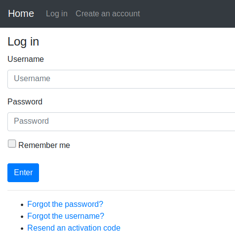
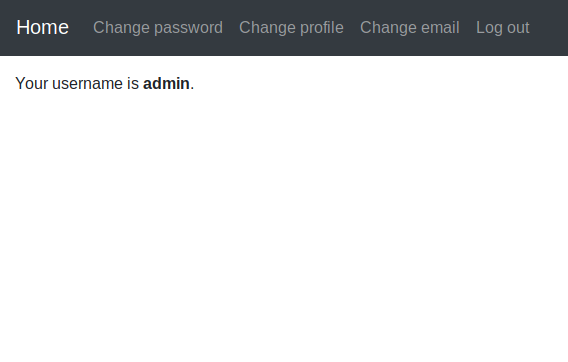

# Simple Django Login and Registration

An example of Django project with basic user functionality.

## Screenshots

| Log In | Create an account | Authorized page |
| -------|--------------|-----------------|
|  |  |  |

| Password reset | Set new password | Password change |
| ---------------|------------------|-----------------|
|  |  |  |

## Functionality

- Log in
    - via username & password
    - via email & password
    - via email or username & password
    - with a remember me checkbox (optional)
- Create an account
- Log out
- Profile activation via email
- Reset password
- Remind a username
- Resend an activation code
- Change password
- Change email
- Change profile
- Multilingual: English, French, Russian, Simplified Chinese and Spanish

### Running

#### A development server

Just run this command:

```bash
python source/manage.py runserver
```
